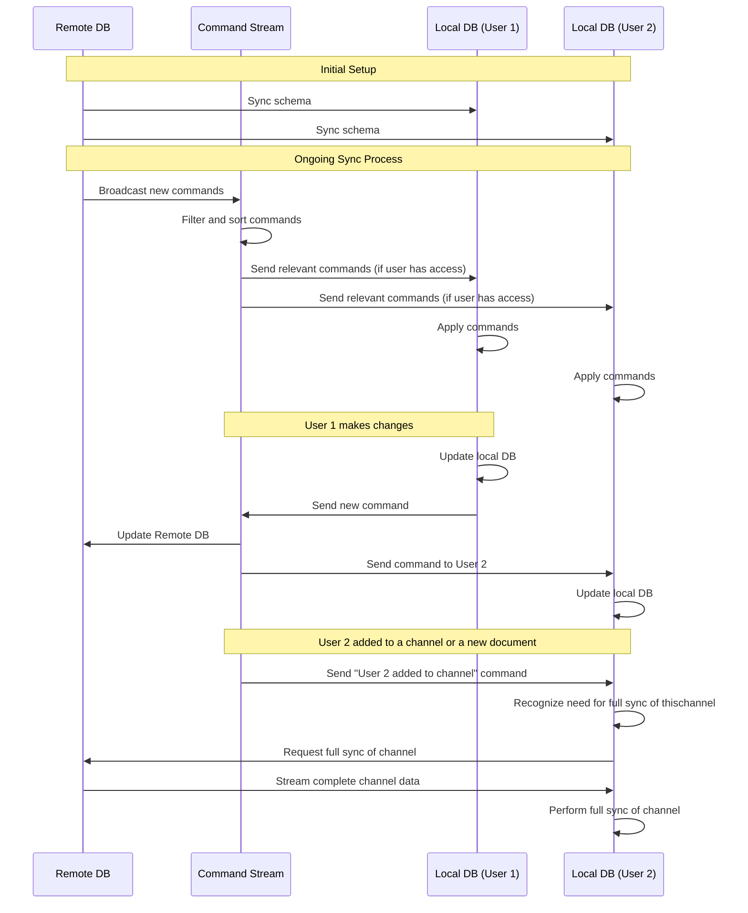
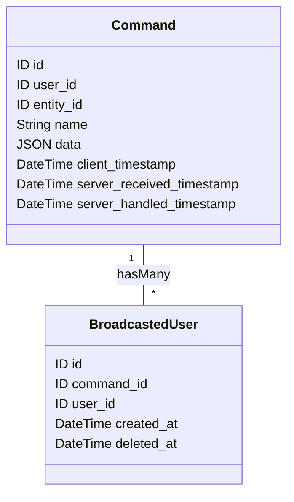

# Alex playing around with local first

The core ideas

- One SQLite database per workspace that exists on the remote server
- Each user of a workspace has a local database with the same schema
- The local db schema is synced with the remote schema based on what the user has access to
- The remote db has an extensive list of "commands" that is an exhaustive list of all actions that has been taken by all users

## Commands

## Command Schema

The following diagram illustrates the structure of a command and its related broadcasted users in our system:

## Command Attributes:

- `id`: Unique identifier for the command
- `user_id`: Identifier of the user who initiated the command
- `entity_id`: Identifier of the entity that was changed by this command
- `name`: Name or type of the command
- `data`: JSON blob containing the command's specific data
- `client_timestamp`: When the command was created on the client
- `server_received_timestamp`: When the server received the command
- `server_handled_timestamp`: When the server processed the command

### BroadcastedUser Attributes:

- `id`: Unique identifier for the broadcasted user record
- `command_id`: Foreign key referencing the associated Command
- `user_id`: Identifier of the user to whom the command was broadcasted
- `created_at`: Timestamp when the user was added to the broadcast list
- `deleted_at`: Timestamp when the user was removed from the broadcast list (null if still active)

## Questions and answers

### Q: Won't broadcasting commands to all users cause scalability issues as the number of users grows?

A: Organizations typically don't have thousands and thousands of users, so broadcasting should be manageable.

### Q: Is there a concern about network overhead due to frequent syncing?

A: Not an issue. Each command uses a CRDT (Conflict-free Replicated Data Type) representation of what has changed, minimizing network traffic.

### Q: How do you handle conflict resolution between users?

A: We follow a "last write wins" policy unless there's a restriction in the side-effect that prevents it - typically for locked or deleted items.

### Q: Are there concerns about data consistency delays during syncing?

A: Users maintain a persistent connection through websockets, which helps minimize consistency delays.

### Q: Could storing all historical commands lead to significant database growth over time?

A: This isn't a major concern as command storage is scoped per organization, limiting overall growth.

### Q: How do you manage offline functionality and syncing?

A: It's straightforward - each command is applied to the local database immediately and added to the user's local command list. This approach simplifies offline operations and subsequent syncing.
