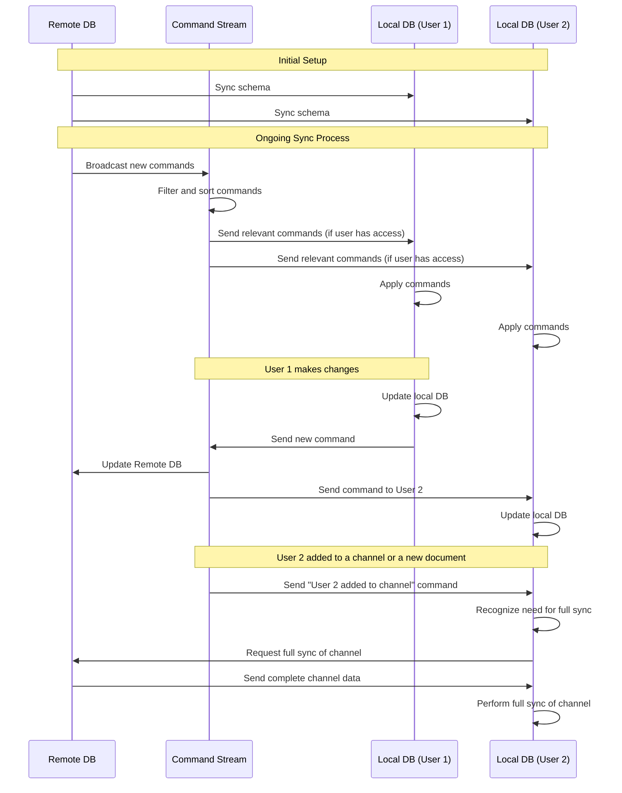

# Alex playing around with local first

The core ideas

- One SQLite database per workspace that exists on the remote server
- Each user has a local database with the same schema
- The local db schema is synced with the remote schema based on what the user has access to
- The remote db has an extensive list of "commands" that is an exhaustive list of all actions that has been taken by all users

## Commands

